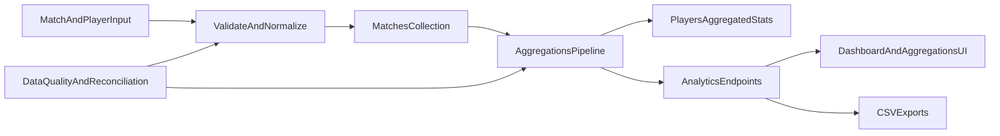

# Arquitetura de Analytics

## Escopo

Este documento descreve o fluxo analítico principal do Galáticos, desde a captura de dados de partidas até o consumo via API, dashboard e exportações.

## Fluxo ponta a ponta

## Componentes principais

### Source of truth

- Coleção `matches` com `player-statistics` no grão jogador-partida.
- É a base para recomputação consistente.

### Camada de agregação

- Pipeline MongoDB em `src/galaticos/db/aggregations.clj`.
- Produz agregados por jogador, campeonato, posição e tempo.

### Cache analítico em jogador

- Campo `players.aggregated-stats` para leitura rápida no dashboard e rankings.
- Deve ser sempre reconciliável com a fonte `matches`.

### Consumo analítico

- Endpoints em `src/galaticos/routes/api.clj` e handlers de agregação/export.
- Frontend consome no dashboard e páginas de agregação.

## Decisões arquiteturais atuais

- Recomputação de estatísticas acoplada ao CRUD de partidas.
- Fallback e reconciliação manual existentes para inconsistências.
- Exportação CSV como ponte com BI externo.

## Limitações conhecidas

- Reprocessamentos podem impactar latência de operações transacionais.
- Ausência de fila/jobs assíncronos para volume alto.
- Contratos de dados ainda precisando de governança explícita por versão.

## Evolução recomendada

1. Introduzir contratos de dados versionados para entradas analíticas.
2. Adicionar processamento assíncrono para recomputações completas.
3. Definir SLOs de atualização e qualidade para métricas críticas.

## Referência de execução técnica

- Plano detalhado de desacoplamento e observabilidade: `docs/analytics/technical-evolution.md`.
