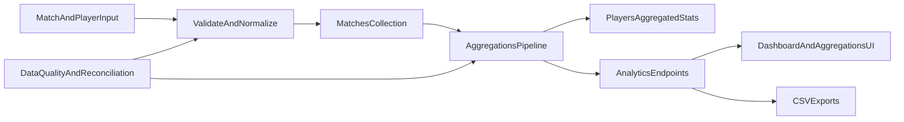

# Arquitetura de Analytics

## Escopo

Este documento descreve o fluxo analítico principal do Galáticos, desde a captura de dados de partidas até o consumo via API, dashboard e exportações.

## Fluxo ponta a ponta

## Componentes principais

### Source of truth

- Coleção `matches` com `player-statistics` no grão jogador-partida.
- É a base para recomputação consistente.

### Camada de agregação

- Pipeline MongoDB em `src/galaticos/db/aggregations.clj`.
- Produz agregados por jogador, campeonato, posição e tempo.
- Por padrão, após CRUD de partida, `update-incremental-player-stats!` restringe o pipeline a partidas/jogadores impactados; `update-all-player-stats` é usado em reconciliação completa ou quando `GALATICOS_PLAYER_STATS_FORCE_FULL=true`.

### Cache analítico em jogador

- Campo `players.aggregated-stats` para leitura rápida no dashboard e rankings.
- Deve ser sempre reconciliável com a fonte `matches`.

### Consumo analítico

- Endpoints em `src/galaticos/routes/api.clj` e handlers de agregação/export.
- Frontend consome no dashboard e páginas de agregação.

## Decisões arquiteturais atuais

- Após CRUD de partidas, recálculo de `players.aggregated-stats` é **agendado** em `galaticos.analytics.player-stats-jobs` (executor in-process, thread única), desacoplado da resposta HTTP por padrão.
- Reconciliação operacional: `POST /api/aggregations/reconcile` (autenticado); padrão síncrono; `?async=true` enfileira recompute completo (ver [reconciliation-runbook.md](reconciliation-runbook.md)).
- Fallback e reconciliação manual existentes para inconsistências.
- Exportação CSV como ponte com BI externo.

Alinhamento com [roadmap.md](roadmap.md) **Fase 2**: desacoplamento da recomputação, reprocessamento incremental/completo e observabilidade de jobs. **Fase 3** (métricas derivadas, preditivo): [advanced-analytics-backlog.md](../../a-fazer/analytics/advanced-analytics-backlog.md).

## Jobs de agregados (player stats)

### Fluxo após CRUD de partida

- Handlers em `src/galaticos/handlers/matches.clj` chamam `galaticos.analytics.player-stats-jobs/submit-incremental-recalc-after-match!` com `{:reason, :op, :match-id, :affected-player-ids}`.
- Worker: `ThreadPoolExecutor` com 1 worker, fila `LinkedBlockingQueue`.
- `update-player-stats-for-match` reutiliza o caminho incremental (útil fora do handler HTTP).

### Variáveis de ambiente

| Variável | Efeito |
|----------|--------|
| `GALATICOS_PLAYER_STATS_SYNC=true` | Recálculo no thread do pedido (testes / depuração). |
| `GALATICOS_PLAYER_STATS_FORCE_FULL=true` | Força `update-all-player-stats` em cada job (incidente). |
| `GALATICOS_PLAYER_STATS_MAX_ATTEMPTS` | Tentativas mín. 1, padrão 3; backoff exponencial com `GALATICOS_PLAYER_STATS_RETRY_BACKOFF_MS` (padrão 100). Sem DLQ. |
| `GALATICOS_PLAYER_STATS_LONG_MS` | Aviso de job longo; padrão 30s. |

### Endpoints e persistência

- `GET /api/aggregations/player-stats-jobs` (autenticado): último sucesso incremental/completo + metadados do executor (`queue-size`, `active-count`, `pool-size`). Handler: `galaticos.handlers.aggregations/player-stats-jobs-status`.
- Coleção Mongo `player_stats_job_meta`, `_id` fixo `player-stats-jobs`: campos `last-incremental` e `last-full` após `outcome :success` (`galaticos.analytics.player-stats-job-store`).

### Observabilidade

Logs estruturados com `:galaticos.event/player-stats-refresh`, `:job-id`, `:recalc` (`:incremental` \| `:full`), `:recalc-execution` (`:sync` \| `:async`), `:outcome`, `:duration-ms`, `:updated`; para jobs de partida também `:op`, `:match-id`, `:affected-count`. Sem Prometheus: agregar taxa de `outcome :error` e percentil de `duration-ms` nos logs.

### Riscos operacionais

- **Consistência eventual**: dashboard/rankings podem atrasar até o job concluir.
- **Falha do job após write**: partida correta, agregados atrasados até retry ou reconciliação.
- **Reprocessamento completo**: pressiona Mongo se mal agendado; usar [reconciliation-runbook.md](reconciliation-runbook.md).

### Evolução futura (escala)

- Fila externa (Redis, SQS), workers múltiplos, DLQ, métricas Prometheus nativas.
- Hoje: executor in-process, retry limitado, reconciliação manual disponível.

## Limitações conhecidas

- Consistência eventual no dashboard enquanto o job não conclui.
- Fila in-process: um único worker; múltiplas instâncias da API exigiriam fila externa ou coordenação adicional.
- Recompute completo ainda percorre todas as partidas; o caminho incremental mitiga o custo no fluxo normal de CRUD.
- Contratos de dados ainda precisando de governança explícita por versão.

## Evolução recomendada

1. Introduzir contratos de dados versionados para entradas analíticas.
2. Fila distribuída e/ou restrição adicional do pipeline completo por campeonato/temporada.
3. Definir SLOs de atualização e qualidade para métricas críticas.

## Referências

- [reconciliation-runbook.md](reconciliation-runbook.md) — reconciliação e incidentes.
- [data-contracts.md](data-contracts.md) — contratos de dados.
- [testing-coverage.md](../dominio/testing-coverage.md) — regressão de métricas.
