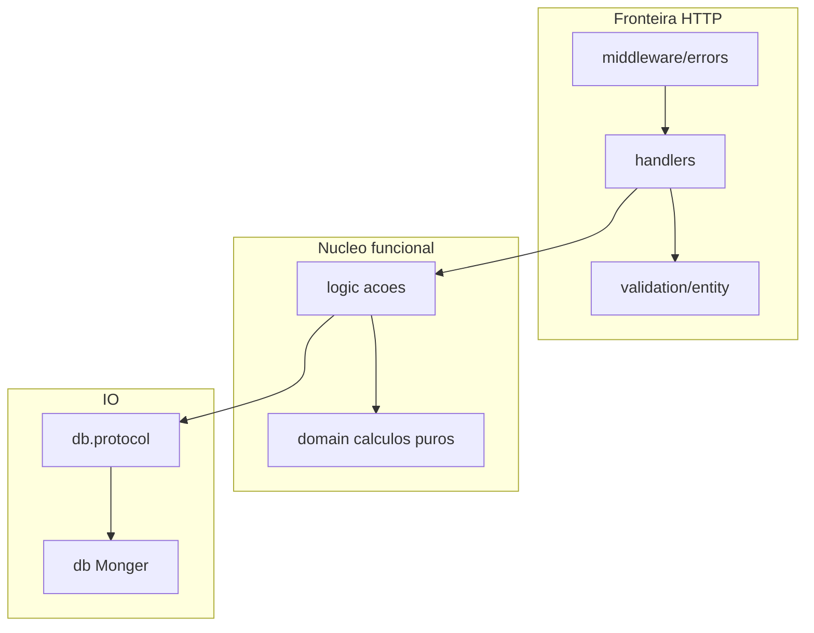

# Arquitetura funcional (Clojure / ClojureScript)

Guia de referência para a migração **OO → programação funcional** no Galáticos. Decisões consolidadas em [notebooklm-response-fp.md](../notebookLM/notebooklm-response-fp.md).

**Implementação:** seguir [plans/README.md](../../plans/README.md) (planos 02–07). Este documento não substitui os planos sequenciais.

---

## Modelo: Ações, Cálculos, Dados

| Camada | O quê | Namespaces | Efeitos |
|--------|-------|------------|---------|
| **Cálculos** | Regras puras, transformações | `galaticos.domain.*` | Nenhum |
| **Ações** | Orquestração, IO, `ex-info` | `galaticos.logic.*` | Sim (`!`) |
| **Dados** | Persistência Monger | `galaticos.db.*` | Sim |
| **Contrato IO** | Protocolos de store | `galaticos.db.protocol.*` | — |
| **Fronteira HTTP** | Parse, validação, resposta | `galaticos.handlers.*`, `validation.*` | Resposta Ring |
| **Erros HTTP** | Mapeamento global | `galaticos.middleware.errors` | — |



---

## Mapa de namespaces

| Namespace | Responsabilidade | Exemplo |
|-----------|------------------|---------|
| `domain/championships` | `can-delete?`, `finalization-decision`, enrich puro | `{:ok _}` / `{:error {:type :status :message}}` |
| `logic/championships` | `create!`, `delete!`, `finalize!` — recebe store | `(defn delete! [store id] ...)` |
| `db.protocol/championship-store` | `defprotocol ChampionshipStore` | `find-by-id`, `delete!` |
| `db/championships` | Monger + `reify` ou record que implementa protocol | `(find-by-id db id)` |
| `handlers/championships` | params/body → `logic` → `resp/success` | Sem `try/catch` repetido |

**Não usar:** `galaticos.service.*`, `galaticos.repository.*`, `repo-call`, `ns-resolve` para DI.

---

## Convenções

### Nomenclatura

- **Puro:** substantivos ou `?` para booleanos — `enrollment-decision`, `eligible?`
- **Efeito:** sufixo `!` — `finalize!`, `update-stats!`
- **Leitura DB:** sem `!` — `find-by-id`, `find-all`

### Erros

- **`domain/*`:** retornar `{:ok data}` ou `{:error {:type :validation|:conflict|:not-found :message "..."}}`
- **`logic/*`:** converter `{:error}` em `(ex-info msg {:status 404|409|400 :code :type})` quando apropriado
- **`handlers/*` + middleware:** mapear `ex-info` e, no futuro, `{:error}` explícito para JSON

### Dependências

```clojure
;; Protocolo
(defprotocol ChampionshipStore
  (find-by-id [this id])
  (delete! [this id]))

;; Logic recebe store
(defn delete-championship! [store id]
  (let [decision (domain/can-delete? (find-by-id store id) (has-matches? store id))]
    (if-let [err (:error decision)]
      (throw (ex-info (:message err) {:status 409 :code (:type err)}))
      (delete! store id))))

;; Teste com reify
(deftest delete-conflict-test
  (let [store (reify ChampionshipStore
                (find-by-id [_ _] {:_id "1"})
                (delete! [_ _] (throw (Exception. "should not run"))))]
    (is (thrown? clojure.lang.ExceptionInfo (delete-championship! store "1")))))
```

### Monger

- Preferir `db` como **primeiro argumento** em funções novas/refactoradas
- ObjectId: coerção em [`validation/entity.clj`](../../src/galaticos/validation/entity.clj) ou handler
- Agregações: pipeline Mongo para filtrar; lógica de merge/rollup pura em `domain/analytics`

### CLJS (Fase UI — Plano 07)

- Um `app-state` atom; transições via `(dispatch! [event-type payload])` + `app-reducer`
- Estado derivado: `reagent.ratom/reaction`
- Fetch e route: só em [`effects.cljs`](../../src-cljs/galaticos/effects.cljs); componentes render-only

---

## Anti-padrões (proibidos após migração)

| Anti-padrão | Por quê |
|-------------|---------|
| `service/*` + `repository/*` facades | OO em linguagem funcional; duplica `db/*` |
| `repo-call` + `ns-resolve` | DI frágil, opaco a testes |
| `with-redefs` em vars de produção | Não thread-safe; acopla testes à forma de injectar |
| Regras BRM inline em handlers | Dificulta teste e composição |
| `try/catch` em cada handler | Usar middleware central |
| Command / Strategy / Observer (GoF) | Substituído por dados + funções + intent maps |

---

## Remoção OO (checklist de código — fase futura)

Quando implementares os planos 02–07:

- [ ] Apagar `src/galaticos/service/championships.clj`
- [ ] Apagar `src/galaticos/repository/championships.clj`
- [ ] Apagar `test/galaticos/service/championships_test.clj` (substituir por domain/logic tests)
- [ ] Apagar `handlers/util.clj` se middleware cobrir tudo
- [ ] Verificar: `rg 'galaticos\.(service|repository)' src/ test/` → zero resultados
- [ ] `./bin/galaticos test` verde + contract tests

**Estado actual do repo:** piloto OO em championships ainda presente — alvo descrito no [Plano 02](../../plans/02-championships-service.md).

---

## Execução (fase de código — fora deste doc)

Ordem sugerida de PRs:

1. **Infra partilhada** — `db.protocol/*`, estender `wrap-errors`, wiring no handler
2. **Plano 02** — championships FP; apagar OO
3. **Planos 03–07** — matches, rollout, analytics, CLJS

Regra de equipa (Plano 01): não misturar refactor estrutural com feature no mesmo PR.

Gate permanente: [Plano 00](../../plans/00-prerequisite-green-tests.md) — `./bin/galaticos test` verde antes de cada plano.

---

## Fundação já feita (Plano 01)

| Entregável | Manter | Evoluir na migração FP |
|------------|--------|-------------------------|
| `validation/entity.clj` | Sim | pipelines `comp` |
| `api_contract_test.clj` | Sim | rede de segurança |
| `domain/errors.clj` | Sim | uso principal em `logic/*`; domain puro usa mapas |
| `wrap-errors` | Sim | mapear também respostas `{:error}` |
| Regra PR refactor/feature | Sim | — |

---

## Referências

- Planos: [README](../../plans/README.md)
- Checklist FP: [fp-improvement-checklist.md](../../a-fazer/notebookLM/fp-improvement-checklist.md)
- Mapa Galáticos: [fp-design-improvements.md](../../a-fazer/notebookLM/fp-design-improvements.md)
- BRM: [regras-de-negocio.md](../dominio/regras-de-negocio.md)
- Analytics jobs: [architecture.md](../analytics/architecture.md)
- Auditoria IA: [auditoria-alucinacoes-ia.md](../qualidade/auditoria-alucinacoes-ia.md)
