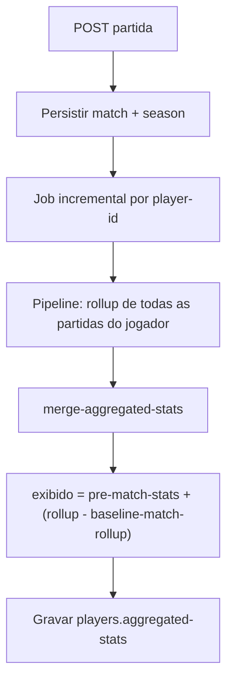

# Guia: partidas, temporadas e estatísticas híbridas

**Última atualização:** junho de 2026

Este guia descreve a lógica que costuma ser reimplementada a cada nova feature em partidas ou estatísticas. Use-o com [regras-de-negocio.md](regras-de-negocio.md) (`RN-MATCH-*`, `RN-STATS-*`) e os testes indicados abaixo.

## 1. Visão geral

| Camada | O quê | Onde |
|--------|--------|------|
| Regras puras | Temporada (create), inscrição, coerência equipa, merge de stats | `domain/matches.clj`, `domain/analytics.clj` |
| Orquestração | CRUD, temporada, recalc | `logic/matches.clj` |
| Persistência | Matches, seasons, pipeline | `db/matches.clj`, `db/seasons.clj`, `db/aggregations.clj` |
| HTTP | Delegação fina | `handlers/matches.clj` |
| UI | Formulário e bloqueios | `src-cljs/.../matches.cljs` |

Após gravar: persistir → `add-match` na temporada → job incremental ([architecture.md](../analytics/architecture.md)).

## 2. Temporadas e criação

- **Create:** só temporada `active` (ou `:season-id` explícito ativo). Sem ativa → 400. Explícita concluída → 403.
- **Update/delete:** permitidos com temporada concluída (**RN-MATCH-09**).

| Operação | Resolução | Validação temporada |
|----------|-----------|---------------------|
| `create!` | `find-season-for-new-match` | `validate-season-for-new-match` |
| `update!` | `season-id` existente ou `find-default-season-for-championship` | Não bloqueia por status |
| `delete!` | `remove-match-from-season!` se houver `season-id` | — |

**UI:** `has-active-season?`, `create-locked?` (só create). Esconder “Nova Partida” sem temporada ativa. Em edição: manter tabela de stats e “Marcar participação de todos”; só desabilitar “Criar Partida”.

## 3. Estatísticas híbridas

### Preencher o banco (dev)

| Comando | O quê |
|---------|--------|
| `./bin/galaticos db:setup` | Índices MongoDB |
| `./bin/galaticos db:seed` | Planilha + BASE_DADOS (idempotente) |
| `./bin/galaticos db:seed --full` | + abas legado, `data/*.csv`, partidas de torneio, ASBAC |
| `./bin/galaticos db:seed-full --reset` | **Recomendado:** wipe + todas as fontes + reconcile Clojure (stats híbridos alinhados ao app) |
| `./bin/galaticos db:check-stats` | Contagens rápidas (jogadores, partidas, metadata híbrida) |

Requisitos: `data/raw/galaticos.xlsm` (ou `EXCEL_FILE`), MongoDB acessível (`MONGO_URI` / `config/docker/.env`). Não misturar com `db:seed-smoke` no mesmo `DB_NAME` sem `--reset`.

O seed Python importa partidas **antes** de `rebuild_aggregated_stats_from_matches`; o passo final de `db:seed-full` roda `galaticos.tasks.reconcile-player-stats` com a mesma lógica de `domain/analytics.clj` usada em produção.

**Objetivo:** contar **toda** a carreira no sistema — planilha, partidas importadas (seed) e partidas criadas na UI, em **todas** as temporadas com documento em `matches`.

**Problema a evitar:** somar o rollup inteiro em cima da planilha quando as partidas importadas já estão refletidas na tabela.

### Três origens por linha (`championship-id` + `season`)

| Origem | Partidas no Mongo | `:pre-match-stats` | `:baseline-match-rollup` | Exibido |
|--------|-------------------|--------------------|---------------------------|---------|
| Só planilha | nenhuma | totais da tabela | — (ou 0) | = planilha |
| Planilha + import | importadas no seed | totais da tabela | rollup já na tabela | planilha + (rollup − frozen) |
| Só partidas | antigas e/ou UI | `{games:0, goals:0, …}` | 0 até inferência | = rollup da temporada |

Exemplos (Jow):

- **MINAS 2025** — só planilha (11 gols); sem partidas nessa season no rollup.
- **OAB 2025** — planilha 13 gols; `baseline-match-rollup` 13 → partidas importadas já na tabela.
- **MINAS 2022** — só partidas (11 gols); sem linha na planilha para 2022.
- **BORA 2026** — partida nova na UI (+1 gol); linha `pm=0`, exibido = rollup da season.

O **`total.goals`** (e jogos/assistências) é a **soma** de todas as linhas `by-championship`, não só temporada ativa. Passar de 87 para 123 após recalcular pode ser correto se antes o cache tinha só 2025 na planilha e o merge passou a incluir temporadas com partidas antigas.

### Fórmula por campeonato/temporada

`exibido = pre-match-stats + (rollup_partidas − baseline-match-rollup)`

- `:pre-match-stats` — baseline da planilha (pode ser 0 se não houve import de tabela para aquela season).
- `:baseline-match-rollup` — parte do rollup já contada no baseline (partidas importadas); congelado no merge.
- Títulos: só da planilha, nunca das partidas.

**Fan-out:** rollup sem `:season` funde na única linha `by-championship` do campeonato (ou soma na linha escopada se já existir). Ver `fanout-unscoped-rollups-into-match-map` em `domain/analytics.clj`.

**Testes obrigatórios antes de mudar merge:** `aggregations_test.clj` (baseline, fan-out, idempotência).

**Incremental:** `update-incremental-player-stats!` — defaults preservam baseline; `:drop-stale-without-match-rollups?` só em reconcile explícito.

### Fluxo ideal (criar partida)



1. Handler/logic valida temporada ativa e inscrição.
2. Partida gravada; `add-match-to-season!`.
3. `submit-incremental-recalc-after-match!` com IDs dos jogadores da partida.
4. Pipeline Mongo agrega **todas** as partidas do jogador (não só a nova), agrupadas por `championship-id` + label da season (`season-id` → `seasons.season`).
5. `merge-aggregated-stats` aplica a fórmula por linha `championship-id|season`; cria linhas novas para temporadas que só existem em `matches`.
6. Linhas só de planilha (sem rollup naquela season) permanecem via `baseline-only-entry`.
7. UI lê o cache atualizado (assíncrono por padrão).

### Requisitos de seed / import

O seed Python (`scripts/python/seed_mongodb.py`) deve gravar em cada linha de `by-championship`:

- `:pre-match-stats` — totais da planilha (tabela).
- `:baseline-match-rollup` — rollup das partidas importadas já refletidas na tabela.

Sem esses campos, jogadores com display alto (ex.: 87 gols) podem inflar ao criar partida (`87 + rollup` em vez de `87 + delta`). O merge tenta reparar overlap via `display-likely-includes-match-rollups?` em `domain/analytics.clj`, mas o caminho seguro é metadata explícita no seed.

### Troubleshooting: gols saltam ao criar partida

**Sintoma A — salto grande no total (ex.: 87 → 123):** muitas vezes o cache tinha **só** linhas de planilha (ex. 2025) e, após recalcular, passaram a aparecer linhas de temporadas com partidas antigas (+35 gols em MINAS 2022, Axbacão, etc.). Isso pode ser **correto** se o produto deve mostrar carreira completa.

**Sintoma B — inflação na mesma season (ex.: 87 → 123 no mesmo campeonato):** linha sem `:pre-match-stats` / `:baseline-match-rollup`; o merge soma o rollup inteiro em cima do display que já incluía import.

**Diagnóstico (MongoDB / mongosh):**

Campos com hífen precisam de aspas no projection e nos estágios de agregação (`"aggregated-stats"`, não `aggregated-stats`).

```javascript
// 1) Cache do jogador
const jow = db.players.findOne(
  { name: /Jow/i },
  { name: 1, "aggregated-stats": 1 }
);
jow;

// 2) Rollup real a partir de partidas (substitua PLAYER_ID pelo _id de jow)
const PLAYER_ID = jow._id;
db.matches.aggregate([
  { $unwind: "$player-statistics" },
  { $match: { "player-statistics.player-id": PLAYER_ID } },
  {
    $group: {
      _id: "$championship-id",
      games: { $sum: 1 },
      goals: { $sum: "$player-statistics.goals" }
    }
  }
]);

// Em cada linha de jow["aggregated-stats"].by-championship, conferir:
// pre-match-stats, baseline-match-rollup, goals
```

**Correção:**

1. **Reconciliar** todos os jogadores a partir de `matches` (recomputa com a lógica atual):
   - API: `POST /api/aggregations/reconcile` (admin) — ver [reconciliation-runbook.md](../analytics/reconciliation-runbook.md)
   - CLI: `clojure -M:dev -m galaticos.tasks.reconcile-player-stats` (lista candidatos sem metadata híbrida e roda `update-all-player-stats`)
2. Reimportar seed com baseline explícito, se a origem for planilha desatualizada.
3. Conferir amostra: gols exibidos ≈ tabela + apenas partidas novas desde o import.

**Testes de regressão:** `merge-aggregated-stats-repairs-goals-only-inflation-without-pre-match-stats` e `merge-aggregated-stats-repairs-goals-only-inflation-with-pre-match-stats` em `test/galaticos/db/aggregations_test.clj`.

### Merge de jogadores + reconciliação na ficha

- Após **mesclar** duplicatas, o master recebe `combine-players-aggregated-stats` (soma por campeonato com `:pre-match-stats`) e um refresh incremental com `zero-if-no-matches? false`.
- O botão **Reconciliar estatísticas** na ficha do jogador usa as **mesmas opções** — não deve zerar histórico só de planilha quando não há partidas em `matches`.
- Se o cache foi zerado por uma versão antiga: restaurar `aggregated-stats` via `merge-audit.before-state` ou `updateOne` manual (ver plano de incidente) **antes** de reconciliar de novo.
- Histórico **sem partidas** no Mongo: reconciliar só recompõe a partir de `matches` + baseline no documento; não recupera totais apagados sozinho.

## 4. Formulário CLJS

- `form-data` / `:player-statistics` por `player-id`.
- `player-stat-row`, `mark-all-participation!`.
- `home-score` = soma de gols dos jogadores.

Checklist extensão: backend `validation/entity` + `is-edit?` vs `create-locked?` + job de stats se mudar contagens.

## 5. Checklist nova feature

- [ ] Create de partida? → temporada ativa (API + UI).
- [ ] Update/delete? → confirmar RN (geralmente permitido).
- [ ] Stats? → testes `merge-aggregated-stats` + job.
- [ ] Partida sem `season-id`? → fan-out.
- [ ] Nova RN em `regras-de-negocio.md` se for regra de produto.

## 6. Referências

- `RN-MATCH-05`–`09`, `RN-STATS-04`–`06` em [regras-de-negocio.md](regras-de-negocio.md)
- `test/galaticos/handlers/matches_test.clj`
- `test/galaticos/db/aggregations_test.clj`
- [03-matches-service.md](../../plans/03-matches-service.md)
- [architecture.md](../analytics/architecture.md)
