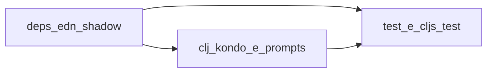

# Auditoria anti-alucinação (código gerado ou assistido por IA)

Guia para revisar o repositório **Galáticos** com foco em erros típicos de modelos de linguagem: APIs inexistentes, `require` incorretos, padrões de outro framework e dependências fictícias.

## Objetivo e escopo

**Alucinação**, neste documento, significa qualquer trecho que *parece* plausível mas não corresponde ao ecossistema real do projeto: função ou macro que não existe na biblioteca declarada, namespace errado, sintaxe inválida, estrutura de diretórios inventada ou coordenadas Maven/Clojars incorretas.

**Fora de escopo:** validação de regras de negócio frente ao domínio (use [regras-negocio-auditoria.md](../dominio/regras-negocio-auditoria.md) para isso). Este guia cobre **código, dependências e ferramentas**.

## Stack de referência (Galáticos)

O projeto **não** usa o template [Luminus](https://luminusweb.com/): não há artefato `luminus` em `deps.edn`. O [README](../../../README.md) na raiz ainda menciona “Luminus”; trate isso como exemplo de **drift documentação ↔ código** e corrija a narrativa quando a descrição oficial for atualizada.

| Camada | Bibliotecas principais | Onde conferir |
|--------|------------------------|---------------|
| JVM / servidor | Clojure 1.11, Ring (+ Jetty), Compojure, ring-defaults | `deps.edn`, `src/galaticos/handler.clj`, rotas em `src/galaticos/routes/` |
| MongoDB | Monger 3.x (`monger.core`, `monger.collection`, etc.) | `src/galaticos/db/` |
| Templates / HTML | Selmer, Hiccup | `resources/templates/`, handlers que renderizam HTML |
| Auth / crypto | Buddy (core, sign, hashers), jBCrypt | `src/galaticos/middleware/auth.clj`, handlers de login |
| Config | Environ | `galaticos.core`, `galaticos.db.core` |
| ClojureScript | shadow-cljs, Reagent, reitit-frontend, cljs-http | `shadow-cljs.edn`, `src-cljs/galaticos/` |
| Build | tools.deps (`deps.edn`), depstar (uberjar), cognitect test-runner, cljs-test-runner | `deps.edn` aliases `:test`, `:cljs-test`, `:uberjar` |

**Layout de código:** namespaces em `src/galaticos/...` (backend) e `src-cljs/galaticos/...` (frontend), **não** `src/main/clj/...` como em alguns templates Java.

Documentação útil (oficial ou mantida pela comunidade):

- [Ring](https://github.com/ring-clojure/ring/wiki)
- [Compojure](https://github.com/weavejester/compojure)
- [Monger](http://clojuremongodb.info/) — atenção à versão 3.x em uso no projeto
- [Selmer](https://github.com/yogthos/Selmer)
- [Buddy](https://github.com/funcool/buddy)
- [shadow-cljs](https://shadow-cljs.github.io/docs/UsersGuide.html)
- [Reagent](https://reagent-project.github.io/)
- [Reitit frontend](https://cljdoc.org/d/metosin/reitit-frontend)

---

## Nível 1 — Checklist por arquivo (Cursor)

Use **um arquivo por vez** para manter precisão. No Cursor, referencie o arquivo com `@file` (ou anexe o path explícito).

### Prompt sugerido (análise por arquivo)

```text
Analise o arquivo @file em busca de alucinações de IA no contexto do projeto Galáticos:
Clojure com Ring, Compojure, Monger 3.x e MongoDB; ClojureScript com shadow-cljs, Reagent e reitit-frontend.

Considere:

1. Namespaces e requires — todos existem? Bibliotecas esperadas: ring.*, compojure.core, monger.core, monger.collection, selmer.parser, buddy.*, environ.core, hiccup.* (backend); reagent.core, reitit.frontend*, cljs-http.client (frontend).
2. Funções e macros — os símbolos usados existem nessas bibliotecas? Nomes quase corretos (ex.: API do driver Java MongoDB misturada com Monger)?
3. Sintaxe Clojure/ClojureScript — parênteses balanceados, keywords, literais de mapa/vetor corretos?
4. Padrão do projeto — handlers em galaticos.handlers.*, rotas Compojure em galaticos.routes.*, DB em galaticos.db.*; no CLJS, componentes em galaticos.components.* e rotas em galaticos.routes (cljs). Nada de mount.core, component integrant ou convenções Luminus se não estiverem no deps.edn.
5. Monger — operações e assinaturas compatíveis com Monger 3.x (ex.: monger.collection/find-maps, insert, update; evitar nomes típicos de outras libs como insert-one no namespace errado).
6. Código não idiomático ou com cheiro de tradução automática de outra linguagem.

Para cada suspeita: por que provavelmente é alucinação, correção exata sugerida e referência à documentação oficial quando possível.
```

### Como aplicar em massa

- Percorra `.clj`, `.cljs`, `.edn` e, se relevante, `.yml` sob `config/`, excluindo `target/` e `node_modules/`.
- Opcional: gere uma lista de arquivos com `find` e audite em lotes pequenos (por exemplo por namespace ou feature).

---

## Nível 2 — Dependências e estrutura de diretórios

Antes da revisão linha a linha, valide **metadados** do projeto.

### Artefatos para anexar ou colar no chat

- [`deps.edn`](../../../deps.edn) e, se versionado, [`deps-lock.edn`](../../../deps-lock.edn)
- [`shadow-cljs.edn`](../../../shadow-cljs.edn)
- [`resources/config.edn`](../../../resources/config.edn) quando a auditoria incluir comportamento da app
- YAMLs em `config/docker/` se a auditoria incluir deploy

### Prompt sugerido (dependências)

```text
Analise o arquivo deps.edn (e shadow-cljs.edn, se aplicável) anexo do projeto Galáticos.
Identifique possíveis alucinações de IA:

1. Alguma dependência não existe no Clojars/Maven Central, nome errado ou versão inverossímil?
2. Coordenadas no formato tools.deps estão corretas? (:mvn/version, git coords, etc.)
3. A combinação é coerente com um app Ring + Compojure + Monger (sem misturar frameworks não declarados)?
4. Aliases (:test, :cljs-test, :uberjar, :format, :coverage) descrevem ferramentas reais e compatíveis?

Se algo for suspeito, indique a coordenada correta ou a ferramenta equivalente verificável.
```

### Árvore de diretórios

Gere uma visão da estrutura para detectar paths inventados (ex.: `src/clj/...` inexistente aqui):

```bash
tree -I 'target|node_modules|.git|.clj-kondo' -L 4
```

Se `tree` não estiver instalado, use `apt install tree` (Debian/Ubuntu) ou equivalente.

---

## Nível 3 — Validação cruzada (ferramentas e runtime)

Erros de `require` ou classes ausentes podem escapar à leitura humana; combine com execução e lint.

### Testes automatizados

- Backend: `./bin/galaticos test` ou `clojure -M:test` (alias `:test` com [cognitect test-runner](https://github.com/cognitect-labs/test-runner)).
- ClojureScript: `clojure -M:cljs-test` (alias `:cljs-test` com cljs-test-runner em Node).

Falhas de compilação ou `ClassNotFoundException` ao carregar namespaces indicam imports ou deps inválidos.

### Lint estático (clj-kondo)

O repositório já possui configuração/cache sob `.clj-kondo/`. Exemplo de varredura:

```bash
clj-kondo --lint src src-cljs test test-cljs
```

Ajuste o comando conforme o padrão da equipe; unresolved symbols e arity errors frequentemente expõem APIs inexistentes.

### Script opcional: carga de namespaces (`clojure.tools.namespace`)

Ferramentas como `clojure.tools.namespace.repl/refresh` ajudam a forçar recarga e revelar erros de dependência entre namespaces. **Nota:** `org.clojure/tools.namespace` pode estar só como dependência transitiva; para um comando `-m` dedicado de auditoria, o mais explícito é adicioná-lo como dependência em um alias (por exemplo `:dev` ou `:audit`) em `deps.edn` e só então manter um script `scripts/...` ou namespace `dev` que execute a varredura. Implementar esse script fica como melhoria opcional após publicar este guia.

Fluxo conceitual:



---

## Prompt panorâmico (toda a aplicação — use com cautela)

Útil para uma primeira varredura; a qualidade cai com muitos arquivos e o contexto do modelo tem limite.

```text
Você receberá um dump de arquivos fonte de uma aplicação Clojure/ClojureScript com Ring, Compojure, Monger e MongoDB (projeto Galáticos).

Varra o código em busca de possíveis alucinações:
- Funções, macros ou namespaces inexistentes nas bibliotecas reais declaradas.
- Sintaxe Clojure inválida ou parênteses desbalanceados.
- Uso de API que não é Monger 3.x em namespaces monger.*.
- Padrões que não pertencem ao stack real (ex.: Luminus/mount sem estar no projeto).

Para cada problema: arquivo, linha aproximada, trecho suspeito, correção sugerida.
Ao final: resumo com contagem por categoria (API / sintaxe / deps / padrão errado).

Aqui está o código:
[COLAR DUMP COM SEPARADORES ENTRE ARQUIVOS]
```

### Gerar o dump (sem segredos)

**Nunca** inclua `.env`, chaves ou URIs com credenciais no dump.

```bash
find . -type f \( -name "*.clj" -o -name "*.cljs" -o -name "*.edn" -o -name "*.yml" \) \
  -not -path "./target/*" \
  -not -path "./node_modules/*" \
  -not -path "./.git/*" \
  -not -name ".env" \
  -exec sh -c 'echo "### FILE: $1 ###"; cat "$1"; echo ""' _ {} \; > full_dump.txt
```

Revise o tamanho de `full_dump.txt` antes de colar em um modelo; truncar por diretório se necessário.

---

## Formato sugerido do relatório de auditoria

Para cada achado:

| Campo | Conteúdo |
|-------|----------|
| Arquivo | Caminho relativo ao repositório |
| Linha | Aproximada |
| Trecho | Citação curta |
| Categoria | API inexistente / sintaxe / dependência / padrão de outro framework |
| Correção | Patch ou snippet correto |
| Referência | Link para documentação ou código-fonte da lib |

Encerre com totais por categoria e lista de arquivos “limpos” ou pendentes de segunda passagem.

---

## Relação com outros documentos

- [regras-negocio-auditoria.md](../dominio/regras-negocio-auditoria.md) — aderência a requisitos de negócio e testes como evidência.
- [testing-coverage.md](../dominio/testing-coverage.md) — estratégia de testes e cobertura.
- [data-quality.md](../analytics/data-quality.md) — qualidade de **dados** analíticos (complementar ao foco em código aqui).
