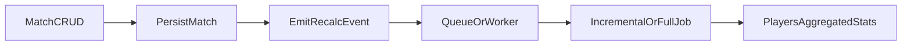

# Evolução Técnica Incremental de Analytics

## Objetivo

Planejar o desacoplamento da recomputação analítica do fluxo transacional de CRUD para melhorar latência, resiliência e capacidade de reprocessamento.

## Alinhamento com o roadmap

- Este plano concretiza a **Fase 2** do [roadmap de analytics](../../informacao/analytics/roadmap.md): desacoplamento da recomputação, reprocessamento incremental e completo, e observabilidade de jobs analíticos.
- **Fase 2 (deployment actual):** *rastreabilidade* = logs estruturados + documento Mongo `player_stats_job_meta` (último sucesso incremental/completo) + `GET /api/aggregations/player-stats-jobs` (autenticado); *reprocessamento* = recálculo incremental/completo já existente + `POST /api/aggregations/reconcile` (ver [runbook](../../informacao/analytics/reconciliation-runbook.md)).
- Os critérios de saída da Fase 2 do roadmap reforçam os critérios de aceite abaixo (latência, reprocessamento controlado, rastreabilidade).
- A **Fase 3** (métricas derivadas, camada preditiva, evolução de painéis) não faz parte deste documento; ver [backlog de analytics avançado](../../a-fazer/analytics/advanced-analytics-backlog.md).

## Situação atual

- Após criar, atualizar ou excluir uma partida, os handlers em `src/galaticos/handlers/matches.clj` chamam `galaticos.analytics.player-stats-jobs/submit-incremental-recalc-after-match!` com `{:reason, :op, :match-id, :affected-player-ids}`. O worker in-process (`ThreadPoolExecutor` com 1 worker, fila `LinkedBlockingQueue`) executa, por padrão, `update-incremental-player-stats!` em `src/galaticos/db/aggregations.clj`, restringindo o pipeline Mongo a partidas/jogadores impactados. `GALATICOS_PLAYER_STATS_FORCE_FULL=true` força `update-all-player-stats` a cada recálculo (depuração / incidente).
- **Retry (transitório):** `GALATICOS_PLAYER_STATS_MAX_ATTEMPTS` (mínimo 1, padrão 3) e `GALATICOS_PLAYER_STATS_RETRY_BACKOFF_MS` (padrão 100) com *backoff* exponencial por tentativa; aplica-se a jobs de partida e a recomputação completa (async e sync). Não constitui DLQ — apenas tolerância a falhas como rede/driver.
- **Estado de último sucesso:** `galaticos.analytics.player-stats-job-store` grava em MongoDB (coleção `player_stats_job_meta`, `_id` fixo `player-stats-jobs`) os campos `last-incremental` e `last-full` após conclusão com `outcome :success` (não entre tentativas de retry).
- **Leitura operacional:** `GET /api/aggregations/player-stats-jobs` (autenticado, como o reconcile) devolve o último sucesso e metadados do executor (`queue-size`, `active-count`, `pool-size`). Handler: `galaticos.handlers.aggregations/player-stats-jobs-status`.
- `GALATICOS_PLAYER_STATS_SYNC=true` (ou `*synchronous-refresh*` em testes) força o recálculo no thread do pedido.
- `GALATICOS_PLAYER_STATS_LONG_MS` (ou `:galaticos-player-stats-long-ms`) ajusta o aviso de job longo; padrão 30s.
- Reconcilição: `POST /api/aggregations/reconcile` (autenticado) — padrão **síncrono** (`synchronous-full-recompute!`, retorno com `updated`); com query **`?async=true`**, resposta **202** e `job-id` após enfileirar recompute completo (`submit-full-recompute!`). Ver [runbook de reconciliação](../../informacao/analytics/reconciliation-runbook.md).
- `update-player-stats-for-match` reutiliza o mesmo caminho incremental para jogadores da partida (útil fora do handler HTTP se necessário).
- Observabilidade: logs com `:galaticos.event/player-stats-refresh`, `:job-id`, `:recalc` (`:incremental` | `:full`), `:recalc-execution` (`:sync` | `:async`), `:outcome`, `:duration-ms`, `:updated`, e para jobs de partida também `:op`, `:match-id`, `:affected-count`. Para “métricas” sem Prometheus, derivar de agregador de logs: taxa de `outcome :error` e percentil de `duration-ms` (alerta quando p95 > SLO).

## Sequência sugerida

1. **Etapa 1** — evento de recálculo e falha de recálculo sem quebrar a transação de partida.
2. **Etapa 2** — reprocessamento incremental, reprocessamento completo sob demanda e idempotência.
3. **Etapa 3** — logs estruturados, métricas e alertas.

## Etapa 1: separar comandos transacionais de processamento analítico

- Manter persistência de partida síncrona.
- Emitir evento interno de recálculo por partida.
- Tratar falhas do recálculo sem quebrar operação transacional.

## Etapa 2: reprocessamento incremental e completo

- **Incremental**: recálculo apenas de jogadores e campeonatos impactados.
- **Completo**: recálculo total sob demanda operacional.
- Garantir idempotência para evitar dupla contagem.

## Etapa 3: observabilidade mínima obrigatória

- Logs estruturados para início/fim de recálculo.
- Métricas operacionais:
  - tempo de processamento por job
  - quantidade de entidades recalculadas
  - taxa de falha
- Alertas para jobs que excederem tempo limite.

## Arquitetura alvo (após Etapas 1 e 2)

Estado desejado: o CRUD retorna após persistir a partida; a recomputação pesada ocorre fora do caminho crítico da requisição.

## Riscos

- **Consistência eventual**: leituras do dashboard ou rankings podem atrasar em relação ao write até o job concluir.
- **Eventos duplicados**: reentrega ou reprocessamento pode exigir idempotência explícita no job.
- **Falha do job após write bem-sucedido**: dados de partida corretos com agregados atrasados ou inconsistentes até retry ou reconciliação.
- **Carga operacional do reprocessamento completo**: execuções totais concorrentes ou mal agendadas podem pressionar MongoDB e workers.

## Decisões (deployment actual) vs evolução futura

**Decidido neste deployment (sem fila externa):**

- **Fila / worker:** executor in-process (thread pool de 1 worker) no mesmo processo da API; visibilidade da fila via `executor-runtime-info` e endpoint `GET` acima.
- **Retry e backoff:** limitados a `GALATICOS_PLAYER_STATS_MAX_ATTEMPTS` e backoff exponencial; sem dead-letter queue dedicada (falha final fica em logs com `outcome :error` e reconciliação manual disponível).
- **Último sucesso:** persistido em `player_stats_job_meta` (ver `player-stats-job-store`).

**Ainda em aberto para evolução (ex.: escala ou isolamento de carga):**

- Processo dedicado, fila externa (Redis, SQS, etc.) ou workers múltiplos.
- DLQ, políticas de retenção e métricas Prometheus nativas (hoje: logs + endpoint +, se necessário, agregador de logs).
- Promoção de conteúdo deste ficheiro para `docs/informacao/` após critério de saída da Fase 2 no roadmap **ou** quando a fila for externalizada.

## Reprocessamento completo e reconciliação

O reprocessamento completo deve ser acionado por vias operacionais ou de manutenção (por exemplo, após importação em lote ou suspeita de desvio), coordenado com o [runbook de reconciliação](../../informacao/analytics/reconciliation-runbook.md). Objetivo: não bloquear a API durante execuções longas, alinhado à Etapa 2. Em incidentes, reconciliação e reexecução de jobs seguem a mesma trilha de qualidade de dados do runbook.

## Critérios de aceite

- Redução de latência em endpoints de partidas sob carga.
- Possibilidade de reprocessar sem indisponibilidade de API.
- Visibilidade operacional suficiente para troubleshooting rápido.

## Dependências

- Contratos de dados estáveis (`docs/informacao/analytics/data-contracts.md`).
- Runbook de reconciliação (`docs/informacao/analytics/reconciliation-runbook.md`).
- Estratégia de testes de regressão (`docs/informacao/dominio/testing-coverage.md`).

## Promoção deste documento

Enquanto a Fase 2 estiver em evolução ou **até** a equipa migrar para fila externa, este arquivo permanece em `docs/parcial/`. A promoção do conteúdo estável para `docs/informacao/analytics/architecture.md` (ou documento dedicado em `docs/informacao/analytics/`) deve ocorrer **quando** forem atingidos os critérios de saída da Fase 2 no [roadmap](../../informacao/analytics/roadmap.md) **ou** após a decisão de arquitectura de desacoplar o worker (o que for primeiro), para evitar duplicação desnecessária.
