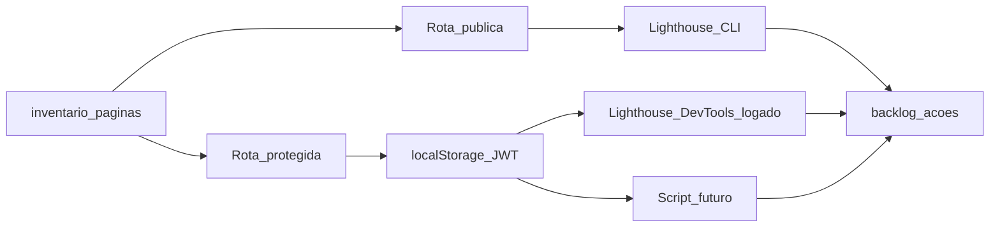

# Metodologia de auditoria de performance

## Base URL e pré-requisitos

1. Subir o backend e o frontend conforme o `README.md` da raiz do repositório (ex.: app em `http://localhost:3000`).
2. Confirmar que a raiz responde (`HTTP 200`) antes de rodar o Lighthouse.

## Lighthouse: o que medir

- Categoria **Performance** cobre carregamento, TBT, LCP, CLS, etc.
- Para comparar telas de forma consistente, anotar sempre: **modo** (mobile ou desktop), **throttling** (padrão Lighthouse ou “no throttling” apenas para debug local), **build** (dev watch vs release) e **data da medição**.

### Opção 1: Chrome DevTools (recomendado para rotas autenticadas)

1. Abrir `http://localhost:3000`, fazer login com um utilizador válido.
2. Navegar até a rota a auditar e **esperar** listas/gráficos carregarem (estado estável).
3. Abrir DevTools → aba **Lighthouse** → marcar **Performance** → gerar relatório.
4. Copiar para [backlog-acoes.md](backlog-acoes.md): **score**, **LCP**, **TBT**, **CLS** e as **top opportunities** (ex.: “Reduce JavaScript execution time”).
5. Repetir por URL listada no [inventario-paginas.md](inventario-paginas.md).

Vantagem: o `localStorage` já contém o JWT; não é preciso automação.

### Opção 2: Lighthouse CLI (rota pública e sanity checks)

Útil principalmente para **`/` (login)**, onde não há exigência de sessão.

Exemplo (só categoria Performance, saída JSON):

```bash
npx lighthouse http://localhost:3000/ \
  --only-categories=performance \
  --output=json \
  --output-path=./lighthouse-login.json \
  --quiet
```

Para extrair o score com Node (após gerar o JSON):

```bash
node -e "const j=require('./lighthouse-login.json'); console.log(Math.round(j.categories.performance.score*100));"
```

**Rotas protegidas:** o CLI, por omissão, **não** injeta `galaticos.auth.token`. Sem passos extra (ver opção B abaixo), o resultado não reflete a tela logada.

### WSL e “Unable to connect to Chrome”

Em ambientes WSL, o Lighthouse pode tentar usar um Chrome instalado no Windows e falhar ao ligar ao DevTools (`ECONNREFUSED` na porta local).

**Mitigação:** usar um Chrome/Chromium **Linux** explícito. Um caminho prático é instalar o binário via Puppeteer e passar `--chrome-path`:

```bash
npx @puppeteer/browsers install chrome@stable
# Anotar o caminho impresso (ex.: .../chrome-linux64/chrome)

CHROME_PATH="<caminho>/chrome" npx lighthouse http://localhost:3000/ \
  --chrome-path="$CHROME_PATH" \
  --chrome-flags="--headless --no-sandbox --disable-gpu" \
  --only-categories=performance \
  --output=json \
  --output-path=./report.json
```

Ajustar flags conforme política de segurança do ambiente (CI vs máquina local).

### Opção B (fase futura): automação reprodutível

Para CI ou bateria fixa de URLs logadas:

1. Obter JWT (login HTTP da API ou formulário automatizado).
2. Lançar navegador (Playwright/Puppeteer), **definir** `localStorage.setItem('galaticos.auth.token', '<jwt>')`, navegar para a URL, depois disparar Lighthouse na mesma sessão ou exportar HAR + trace.

Esta automação **não** faz parte do escopo mínimo desta documentação; quando existir, referenciar o script em `scripts/` nesta página.

## Fluxo resumido



## Consistência entre auditorias

- Usar o **mesmo** utilizador e volume de dados de teste quando possível (ex.: mesma equipa após seed).
- Para páginas com **listas grandes**, anotar quantidade aproximada de registos (impacta LCP e TBT).
- Após alterações relevantes no front, **re-medir** e atualizar a data na coluna de baseline em [backlog-acoes.md](backlog-acoes.md).
