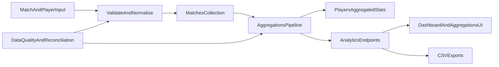
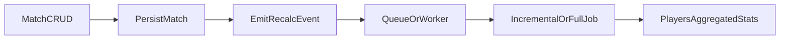

# Analytics Architecture

**Summary:** Describes the end-to-end analytics flow from match capture through API, dashboard, and exports. Match data is the source of truth; `players.aggregated-stats` is a reconcilable cache updated by in-process jobs after CRUD. Operational reconciliation and data contracts are documented in linked runbooks.

## Scope

This document describes Galáticos’ main analytics flow, from match data capture through consumption via API, dashboard, and exports.

## End-to-end flow

## Main components

### Source of truth

- `matches` collection with `player-statistics` at player-match grain.
- Base for consistent recomputation.

### Aggregation layer

- MongoDB pipeline in `src/galaticos/db/aggregations.clj`.
- Produces aggregates by player, championship, position, and time.
- By default, after match CRUD, `update-incremental-player-stats!` restricts the pipeline to impacted matches/players; `update-all-player-stats` is used for full reconciliation or when `GALATICOS_PLAYER_STATS_FORCE_FULL=true`.

### Player analytics cache

- `players.aggregated-stats` field for fast dashboard and ranking reads.
- Must always be reconcilable with the `matches` source.

### Analytics consumption

- Endpoints in `src/galaticos/routes/api.clj` and aggregation/export handlers.
- Frontend consumes on dashboard and aggregation pages.

## Current architectural decisions

- After match CRUD, `players.aggregated-stats` recalculation is **scheduled** in `galaticos.analytics.player-stats-jobs` (in-process executor, single thread), decoupled from the HTTP response by default.
- Operational reconciliation: `POST /api/aggregations/reconcile` (authenticated); synchronous by default; `?async=true` enqueues full recompute (see [reconciliation-runbook.md](reconciliation-runbook.md)).
- Fallback and manual reconciliation exist for inconsistencies.
- CSV export as a bridge to external BI.

Alignment with [roadmap.md](roadmap.md) **Phase 2**: decouple recomputation, incremental/full reprocessing, and job observability. **Phase 3** (derived metrics, predictive): [advanced-analytics-backlog.md](../../backlog/analytics/advanced-analytics-backlog.md).

## Player stats aggregate jobs

### Flow after match CRUD

- Handlers in `src/galaticos/handlers/matches.clj` call `galaticos.analytics.player-stats-jobs/submit-incremental-recalc-after-match!` with `{:reason, :op, :match-id, :affected-player-ids}`.
- Worker: `ThreadPoolExecutor` with 1 worker, `LinkedBlockingQueue` queue.
- `update-player-stats-for-match` reuses the incremental path (useful outside the HTTP handler).

### Environment variables

| Variable | Effect |
|----------|--------|
| `GALATICOS_PLAYER_STATS_SYNC=true` | Recalculation on the request thread (tests / debugging). |
| `GALATICOS_PLAYER_STATS_FORCE_FULL=true` | Forces `update-all-player-stats` on every job (incident). |
| `GALATICOS_PLAYER_STATS_MAX_ATTEMPTS` | Minimum 1 attempts, default 3; exponential backoff with `GALATICOS_PLAYER_STATS_RETRY_BACKOFF_MS` (default 100). No DLQ. |
| `GALATICOS_PLAYER_STATS_LONG_MS` | Long-job warning; default 30s. |

### Endpoints and persistence

- `GET /api/aggregations/player-stats-jobs` (authenticated): last incremental/full success + executor metadata (`queue-size`, `active-count`, `pool-size`). Handler: `galaticos.handlers.aggregations/player-stats-jobs-status`.
- Mongo collection `player_stats_job_meta`, fixed `_id` `player-stats-jobs`: `last-incremental` and `last-full` fields after `outcome :success` (`galaticos.analytics.player-stats-job-store`).

### Observability

Structured logs with `:galaticos.event/player-stats-refresh`, `:job-id`, `:recalc` (`:incremental` \| `:full`), `:recalc-execution` (`:sync` \| `:async`), `:outcome`, `:duration-ms`, `:updated`; for match jobs also `:op`, `:match-id`, `:affected-count`. No Prometheus: aggregate `outcome :error` rate and `duration-ms` percentiles from logs.

### Operational risks

- **Eventual consistency**: dashboard/rankings may lag until the job completes.
- **Job failure after write**: match is correct, aggregates lag until retry or reconciliation.
- **Full reprocessing**: stresses Mongo if poorly scheduled; use [reconciliation-runbook.md](reconciliation-runbook.md).

### Future evolution (scale)

- External queue (Redis, SQS), multiple workers, DLQ, native Prometheus metrics.
- Today: in-process executor, limited retry, manual reconciliation available.

## Known limitations

- Eventual consistency on the dashboard until the job completes.
- In-process queue: single worker; multiple API instances need an external queue or extra coordination.
- Full recompute still scans all matches; the incremental path mitigates cost on normal match CRUD.
- Data contracts still need explicit per-version governance.

## Recommended evolution

1. Introduce versioned data contracts for analytics inputs.
2. Distributed queue and/or further restriction of full pipeline by championship/season.
3. Define update and quality SLOs for critical metrics.

## References

- [reconciliation-runbook.md](reconciliation-runbook.md) — reconciliation and incidents.
- [data-contracts.md](data-contracts.md) — data contracts.
- [testing-coverage.md](../domain/testing-coverage.md) — metric regression.
