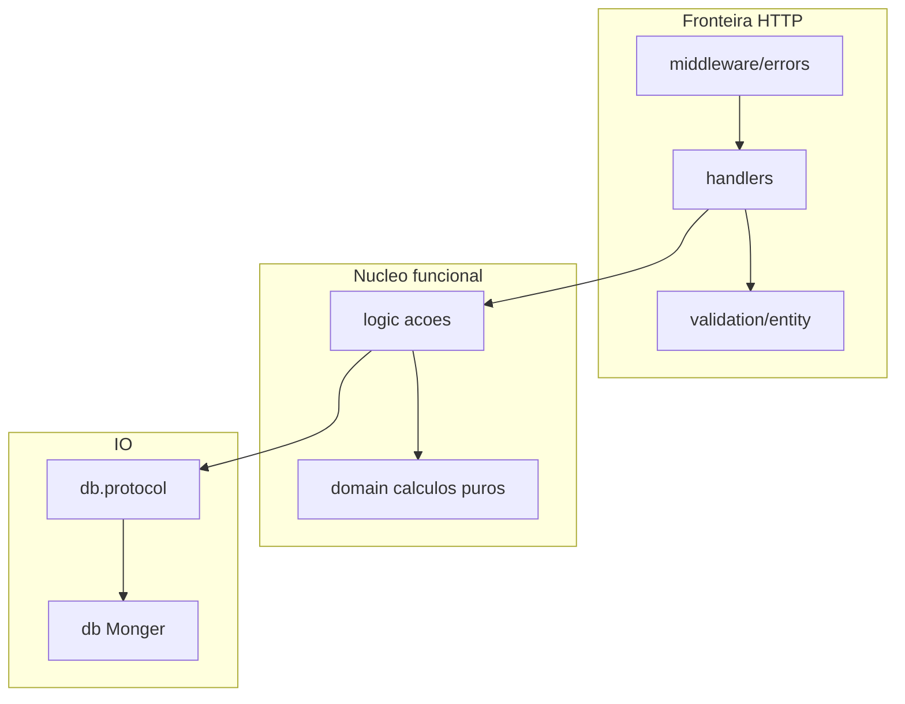

# Functional architecture (Clojure / ClojureScript)

**Summary:** Reference guide for Galáticos’ **functional** backend layout (`domain/*`, `logic/*`, `db/*`). Read this when you add handlers, pure rules, or persistence. Historical decisions: [notebooklm-response-fp.md](../../archive/notebookLM/fp/notebooklm-response-fp.md). Open migration tasks: [fp-improvement-checklist.md](../../backlog/fp-improvement-checklist.md).

---

## Model: Actions, Calculations, Data

| Layer | What | Namespaces | Effects |
|-------|------|------------|---------|
| **Calculations** | Pure rules, transformations | `galaticos.domain.*` | None |
| **Actions** | Orchestration, IO, `ex-info` | `galaticos.logic.*` | Yes (`!`) |
| **Data** | Monger persistence | `galaticos.db.*` | Yes |
| **IO contract** | Store protocols | `galaticos.db.protocol.*` | — |
| **HTTP boundary** | Parse, validation, response | `galaticos.handlers.*`, `validation.*` | Ring response |
| **HTTP errors** | Global mapping | `galaticos.middleware.errors` | — |



---

## Namespace map

| Namespace | Responsibility | Example |
|-----------|------------------|---------|
| `domain/championships` | `can-delete?`, `finalization-decision`, pure enrich | `{:ok _}` / `{:error {:type :status :message}}` |
| `logic/championships` | `create!`, `delete!`, `finalize!` — receives store | `(defn delete! [store id] ...)` |
| `db.protocol/championship-store` | `defprotocol ChampionshipStore` | `find-by-id`, `delete!` |
| `db/championships` | Monger + `reify` or record implementing protocol | `(find-by-id db id)` |
| `handlers/championships` | params/body → `logic` → `resp/success` | No repeated `try/catch` |

**Do not use:** `galaticos.service.*`, `galaticos.repository.*`, `repo-call`, `ns-resolve` for DI.

---

## Conventions

### Naming

- **Pure:** nouns or `?` for booleans — `enrollment-decision`, `eligible?`
- **Effect:** `!` suffix — `finalize!`, `update-stats!`
- **DB read:** no `!` — `find-by-id`, `find-all`

### Errors

- **`domain/*`:** return `{:ok data}` or `{:error {:type :validation|:conflict|:not-found :message "..."}}`
- **`logic/*`:** convert `{:error}` to `(ex-info msg {:status 404|409|400 :code :type})` when appropriate
- **`handlers/*` + middleware:** map `ex-info` and, in the future, explicit `{:error}` to JSON

### Dependencies

```clojure
;; Protocolo
(defprotocol ChampionshipStore
  (find-by-id [this id])
  (delete! [this id]))

;; Logic recebe store
(defn delete-championship! [store id]
  (let [decision (domain/can-delete? (find-by-id store id) (has-matches? store id))]
    (if-let [err (:error decision)]
      (throw (ex-info (:message err) {:status 409 :code (:type err)}))
      (delete! store id))))

;; Teste com reify
(deftest delete-conflict-test
  (let [store (reify ChampionshipStore
                (find-by-id [_ _] {:_id "1"})
                (delete! [_ _] (throw (Exception. "should not run"))))]
    (is (thrown? clojure.lang.ExceptionInfo (delete-championship! store "1")))))
```

### Monger

- Prefer `db` as the **first argument** in new/refactored functions
- ObjectId: coercion in [`validation/entity.clj`](../../src/galaticos/validation/entity.clj) or handler
- Aggregations: Mongo pipeline for filtering; pure merge/rollup logic in `domain/analytics`

### CLJS (UI phase — Plan 07)

- One `app-state` atom; transitions via `(dispatch! [event-type payload])` + `app-reducer`
- Derived state: `reagent.ratom/reaction`
- Fetch and routing only in [`effects.cljs`](../../src-cljs/galaticos/effects.cljs); components are render-only

---

## Anti-patterns (forbidden after migration)

| Anti-pattern | Why |
|--------------|-----|
| `service/*` + `repository/*` facades | OO in a functional language; duplicates `db/*` |
| `repo-call` + `ns-resolve` | Fragile DI, opaque to tests |
| `with-redefs` on production vars | Not thread-safe; couples tests to injection style |
| BRM rules inline in handlers | Hard to test and compose |
| `try/catch` in every handler | Use central middleware |
| Command / Strategy / Observer (GoF) | Replaced by data + functions + intent maps |

---

## FP migration status

Phases B–C (championships, matches) and global OO cleanup are **done**. Optional refactors: [fp-improvement-checklist.md](../../backlog/fp-improvement-checklist.md#optional-follow-ups).

---

## Suggested PR order (historical)

1. **Shared infra** — `db.protocol/*`, extend `wrap-errors`, handler wiring
2. **Phase B** — championships FP; remove OO
3. **Phases C–E** — matches, rollout, analytics (all shipped)

Team rule: do not mix structural refactor with feature work in the same PR.

Permanent gate: `./bin/galaticos test` green before each migration PR (Phase 0).

---

## Foundation already done (Phase 0 / Plan 01)

| Deliverable | Keep | Evolve in FP migration |
|-------------|------|-------------------------|
| `validation/entity.clj` | Yes | `comp` pipelines |
| `api_contract_test.clj` | Yes | Safety net |
| `domain/errors.clj` | Yes | Primary use in `logic/*`; pure domain uses maps |
| `wrap-errors` | Yes | Also map explicit `{:error}` responses |
| PR refactor/feature rule | Yes | — |

---

## References

- FP checklist: [fp-improvement-checklist.md](../../backlog/fp-improvement-checklist.md)
- Galáticos map: [fp-design-improvements.md](../../backlog/fp-design-improvements.md)
- BRM: [business-rules.md](../domain/business-rules.md)
- Analytics jobs: [architecture.md](../analytics/architecture.md)
- AI audit: [ai-assisted-code-audit.md](../quality/ai-assisted-code-audit.md)
