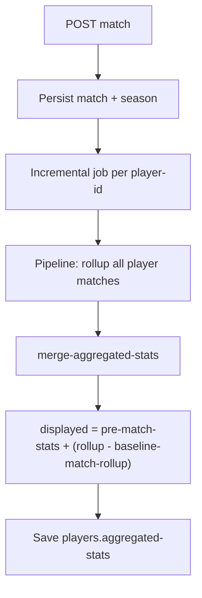

# Matches, seasons, and hybrid statistics

**Last updated:** June 2026

**Summary:** Implementation guide for match CRUD, active seasons, and the hybrid aggregated-stats model (`pre-match-stats`, `baseline-match-rollup`, fan-out). Read this when you touch match writes or stat rollups. Use with [concepts.md](../../concepts.md), [business-rules.md](business-rules.md) (`RN-MATCH-*`, `RN-STATS-*`), and the tests listed below.

## Contents

- [Overview](#1-overview)
- [Seasons and creation](#2-seasons-and-creation)
- [Hybrid statistics](#3-hybrid-statistics)
- [CLJS form](#4-cljs-form)
- [New feature checklist](#5-new-feature-checklist)
- [References](#6-references)

## 1. Overview

| Layer | Responsibility | Location |
|-------|----------------|----------|
| Pure rules | Season (create), enrollment, team consistency, stat merge | `domain/matches.clj`, `domain/analytics.clj` |
| Orchestration | CRUD, season, recalc | `logic/matches.clj` |
| Persistence | Matches, seasons, pipeline | `db/matches.clj`, `db/seasons.clj`, `db/aggregations.clj` |
| HTTP | Thin delegation | `handlers/matches.clj` |
| UI | Form and locks | `src-cljs/.../matches.cljs` |

After save: persist → `add-match` on season → incremental job ([architecture.md](../analytics/architecture.md)).

## 2. Seasons and creation

- **Create:** only an `active` season (or explicit active `:season-id`). No active season → 400. Explicit completed season → 403.
- **Update/delete:** allowed with completed season (**RN-MATCH-09**).

| Operation | Resolution | Season validation |
|-----------|------------|-----------------|
| `create!` | `find-season-for-new-match` | `validate-season-for-new-match` |
| `update!` | existing `season-id` or `find-default-season-for-championship` | Does not block on status |
| `delete!` | `remove-match-from-season!` when `season-id` present | — |

**UI:** `has-active-season?`, `create-locked?` (create only). Hide “New match” without active season. On edit: keep stats table and “Mark all participation”; only disable “Create match”.

## 3. Hybrid statistics

### Populating the database (dev)

| Command | Purpose |
|---------|---------|
| `./bin/galaticos db:setup` | MongoDB indexes |
| `./bin/galaticos db:seed` | Spreadsheet + BASE_DADOS (idempotent) |
| `./bin/galaticos db:seed --full` | + legacy sheets, `data/*.csv`, tournament matches, ASBAC |
| `./bin/galaticos db:seed-full --reset` | **Recommended:** wipe + all sources + Clojure reconcile (hybrid stats aligned with app) |
| `./bin/galaticos db:check-stats` | Quick counts (players, matches, hybrid metadata) |

Requirements: `data/raw/galaticos.xlsm` (or `EXCEL_FILE`), MongoDB reachable (`MONGO_URI` / `config/docker/.env`). Do not mix with `db:seed-smoke` on the same `DB_NAME` without `--reset`.

Python seed imports matches **before** `rebuild_aggregated_stats_from_matches`; the final `db:seed-full` step runs `galaticos.tasks.reconcile-player-stats` with the same logic as production `domain/analytics.clj`.

**Goal:** count the player’s **full career** in the system — spreadsheet, imported matches (seed), and UI-created matches, across **all** seasons with documents in `matches`.

**Problem to avoid:** adding the full rollup on top of the spreadsheet when imported matches are already reflected in the table.

### Three origins per row (`championship-id` + `season`)

| Origin | Matches in Mongo | `:pre-match-stats` | `:baseline-match-rollup` | Displayed |
|--------|------------------|--------------------|---------------------------|-----------|
| Spreadsheet only | none | table totals | — (or 0) | = spreadsheet |
| Spreadsheet + import | seed imports | table totals | rollup already in table | spreadsheet + (rollup − frozen) |
| Matches only | old and/or UI | `{games:0, goals:0, …}` | 0 until inference | = season rollup |

Examples (Jow):

- **MINAS 2025** — spreadsheet only (11 goals); no matches in that season in rollup.
- **OAB 2025** — spreadsheet 13 goals; `baseline-match-rollup` 13 → imported matches already in table.
- **MINAS 2022** — matches only (11 goals); no spreadsheet row for 2022.
- **BORA 2026** — new UI match (+1 goal); row `pm=0`, displayed = season rollup.

**`total.goals`** (and games/assists) is the **sum** of all `by-championship` lines, not only the active season. Moving from 87 to 123 after recalc may be correct if the cache previously had only 2025 from the spreadsheet and merge now includes seasons with old matches.

### Formula per championship/season

`displayed = pre-match-stats + (match_rollup − baseline-match-rollup)`

- `:pre-match-stats` — spreadsheet baseline (may be 0 if no table import for that season).
- `:baseline-match-rollup` — part of rollup already counted in baseline (imported matches); frozen at merge.
- Titles: spreadsheet only, never from matches.

**Fan-out:** rollup without `:season` merges into the single `by-championship` line for the championship (or adds to scoped line if it exists). See `fanout-unscoped-rollups-into-match-map` in `domain/analytics.clj`.

**Required tests before changing merge:** `aggregations_test.clj` (baseline, fan-out, idempotence).

**Incremental:** `update-incremental-player-stats!` — defaults preserve baseline; `:drop-stale-without-match-rollups?` only on explicit reconcile.

### Ideal flow (create match)



1. Handler/logic validates active season and enrollment.
2. Match saved; `add-match-to-season!`.
3. `submit-incremental-recalc-after-match!` with player IDs from the match.
4. Mongo pipeline aggregates **all** player matches (not only the new one), grouped by `championship-id` + season label (`season-id` → `seasons.season`).
5. `merge-aggregated-stats` applies the formula per `championship-id|season` line; creates new lines for seasons that exist only in `matches`.
6. Spreadsheet-only lines (no rollup in that season) remain via `baseline-only-entry`.
7. UI reads updated cache (async by default).

### Seed / import requirements

Python seed (`scripts/python/seed_mongodb.py`) must write on each `by-championship` line:

- `:pre-match-stats` — spreadsheet totals (table).
- `:baseline-match-rollup` — rollup of imported matches already in the table.

Without these fields, players with high display (e.g. 87 goals) may inflate when creating a match (`87 + rollup` instead of `87 + delta`). Merge tries to repair overlap via `display-likely-includes-match-rollups?` in `domain/analytics.clj`, but explicit metadata in seed is the safe path.

### Troubleshooting: goals jump on match create

**Symptom A — large total jump (e.g. 87 → 123):** cache often had **only** spreadsheet lines (e.g. 2025); after recalc, seasons with old matches appeared (+35 goals in MINAS 2022, etc.). May be **correct** if the product must show full career.

**Symptom B — inflation in same season (e.g. 87 → 123 in same championship):** line without `:pre-match-stats` / `:baseline-match-rollup`; merge adds full rollup on display that already included import.

**Diagnosis (MongoDB / mongosh):**

Hyphenated fields need quotes in projection and aggregation stages (`"aggregated-stats"`, not `aggregated-stats`).

```javascript
// 1) Player cache
const jow = db.players.findOne(
  { name: /Jow/i },
  { name: 1, "aggregated-stats": 1 }
);
jow;

// 2) Real rollup from matches (replace PLAYER_ID with jow._id)
const PLAYER_ID = jow._id;
db.matches.aggregate([
  { $unwind: "$player-statistics" },
  { $match: { "player-statistics.player-id": PLAYER_ID } },
  {
    $group: {
      _id: "$championship-id",
      games: { $sum: 1 },
      goals: { $sum: "$player-statistics.goals" }
    }
  }
]);

// On each jow["aggregated-stats"].by-championship line, check:
// pre-match-stats, baseline-match-rollup, goals
```

**Fix:**

1. **Reconcile** all players from `matches` (recomputes with current logic):
   - API: `POST /api/aggregations/reconcile` (admin) — see [reconciliation-runbook.md](../analytics/reconciliation-runbook.md)
   - CLI: `clojure -M:dev -m galaticos.tasks.reconcile-player-stats`
2. Re-import seed with explicit baseline if source spreadsheet is stale.
3. Sample check: displayed goals ≈ table + only new matches since import.

**Regression tests:** `merge-aggregated-stats-repairs-goals-only-inflation-without-pre-match-stats` and `merge-aggregated-stats-repairs-goals-only-inflation-with-pre-match-stats` in `test/galaticos/db/aggregations_test.clj`.

### Player merge + reconcile on profile

- After **merging** duplicates, master gets `combine-players-aggregated-stats` (sum per championship with `:pre-match-stats`) and incremental refresh with `zero-if-no-matches? false`.
- **Reconcile statistics** on player profile uses the **same options** — must not zero spreadsheet-only history when there are no matches in `matches`.
- If cache was zeroed by an old version: restore `aggregated-stats` via `merge-audit.before-state` or manual `updateOne` before reconciling again.
- History **without matches** in Mongo: reconcile only rebuilds from `matches` + baseline on document; does not recover deleted totals alone.

## 4. CLJS form

- `form-data` / `:player-statistics` by `player-id`.
- `player-stat-row`, `mark-all-participation!`.
- `home-score` = sum of player goals.

Extension checklist: backend `validation/entity` + `is-edit?` vs `create-locked?` + stats job if counts change.

## 5. New feature checklist

- [ ] Match create? → active season (API + UI).
- [ ] Update/delete? → confirm RN (usually allowed).
- [ ] Stats? → `merge-aggregated-stats` + job tests.
- [ ] Match without `season-id`? → fan-out.
- [ ] New product RN in [business-rules.md](business-rules.md).

## 6. References

- `RN-MATCH-05`–`09`, `RN-STATS-04`–`06` in [business-rules.md](business-rules.md)
- `test/galaticos/handlers/matches_test.clj`
- `test/galaticos/db/aggregations_test.clj`
- [functional-architecture.md](../architecture/functional-architecture.md)
- [architecture.md](../analytics/architecture.md)
