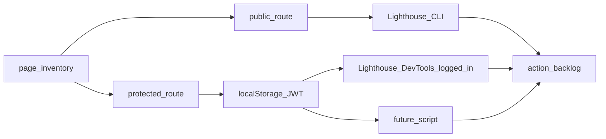

# Performance audit methodology

**Summary:** How to run Lighthouse (DevTools and CLI), handle WSL/Chrome, build release bundles in Docker, and record results in the performance backlog for public and authenticated routes.

## Base URL and prerequisites

1. Start backend and frontend per the repository root `README.md` (e.g. app at `http://localhost:3000`).
2. Confirm the root responds (`HTTP 200`) before running Lighthouse.

## Lighthouse: what to measure

- The **Performance** category covers load, TBT, LCP, CLS, etc.
- For comparable screens, always note: **mode** (mobile or desktop), **throttling** (Lighthouse default or “no throttling” for local debug only), **build** (dev watch vs release), and **measurement date**.

### Option 1: Chrome DevTools (recommended for authenticated routes)

1. Open `http://localhost:3000`, log in with a valid user.
2. Navigate to the route to audit and **wait** for lists/charts to finish loading (stable state).
3. Open DevTools → **Lighthouse** tab → check **Performance** → generate report.
4. Copy to [action-backlog.md](../../backlog/performance/action-backlog.md): **score**, **LCP**, **TBT**, **CLS**, and **top opportunities** (e.g. “Reduce JavaScript execution time”).
5. Repeat for each URL in [page-inventory.md](page-inventory.md).

Advantage: `localStorage` already has the JWT; no automation required.

### Option 2: Lighthouse CLI (public route and sanity checks)

Mainly useful for **`/` (login)**, where no session is required.

Example (Performance category only, JSON output):

```bash
npx lighthouse http://localhost:3000/ \
  --only-categories=performance \
  --output=json \
  --output-path=./lighthouse-login.json \
  --quiet
```

To extract the score with Node (after generating JSON):

```bash
node -e "const j=require('./lighthouse-login.json'); console.log(Math.round(j.categories.performance.score*100));"
```

**Protected routes:** the CLI does **not** inject `galaticos.auth.token` by default. Without extra steps (option B below), results do not reflect the logged-in screen.

### WSL and “Unable to connect to Chrome”

On WSL, Lighthouse may try Windows Chrome and fail to connect to DevTools (`ECONNREFUSED` on the local port). The launcher log may show `chrome.exe` under `/mnt/c/...` even when `--chrome-path` is passed.

**Mitigation:** set **`CHROME_PATH`** to **Linux** Chrome (the launcher prefers this). Practical install:

```bash
npx @puppeteer/browsers install chrome@stable
# Export the printed path, e.g.:
export CHROME_PATH="$PWD/chrome/linux-147.0.7727.24/chrome-linux64/chrome"

CHROME_PATH="$CHROME_PATH" npx lighthouse http://localhost:3000/ \
  --chrome-flags="--headless=new --no-sandbox --disable-gpu --disable-dev-shm-usage" \
  --only-categories=performance \
  --output=json \
  --output-path=./docs/perf-output/lighthouse-login.json
```

Ignore the `chrome/` folder in Git (see `.gitignore`).

### Release build with Docker Dev

`js/compiled` in development often lives in a Docker **volume** (`galaticos-compiled`), not only on the host. To generate the minified bundle the container serves:

```bash
docker compose -f config/docker/docker-compose.dev.yml exec -T frontend-watch npx shadow-cljs release app
```

### Option B: reproducible automation (logged-in Lighthouse)

A script starts Chrome via `chrome-launcher`, logs in on the UI (`admin` / `admin`, same as e2e), and runs Lighthouse on the given URLs with `disableStorageReset`:

- File: `scripts/performance/lighthouse-authenticated.cjs`
- Example: `CHROME_PATH=... node scripts/performance/lighthouse-authenticated.cjs "/#/dashboard" "/#/stats"`

For future CI: prefer JWT from API + `localStorage`, no credentials in the repo; reuse the same Lighthouse+puppeteer flow.

## Summary flow



## Consistency across audits

- Use the **same** user and test data volume when possible (e.g. same team after seed).
- For pages with **large lists**, note approximate record count (affects LCP and TBT).
- After relevant front-end changes, **re-measure** and update the baseline date in [action-backlog.md](../../backlog/performance/action-backlog.md).
