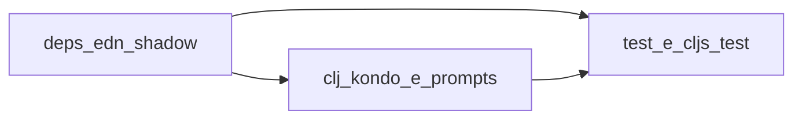

# AI-assisted code audit (anti-hallucination)

**Summary:** This guide helps you review the **Galáticos** repository for typical large-language-model mistakes: nonexistent APIs, wrong `require` forms, patterns from other frameworks, and fictional dependencies. It focuses on **code, dependencies, and tooling**—not business-rule validation (see [business-rules-audit.md](../domain/business-rules-audit.md)). Use the three levels below (per-file prompts, dependency metadata, and automated checks) together for reliable results.

## Purpose and scope

**Hallucination**, in this document, means any snippet that *looks* plausible but does not match the project’s real ecosystem: a function or macro that does not exist in the declared library, a wrong namespace, invalid syntax, an invented directory layout, or incorrect Maven/Clojars coordinates.

**Out of scope:** validating business rules against the domain (use [business-rules-audit.md](../domain/business-rules-audit.md) for that). This guide covers **code, dependencies, and tools**.

## Reference stack (Galáticos)

The project **does not** use the [Luminus](https://luminusweb.com/) template: there is no `luminus` artifact in `deps.edn`. The official stack is in the [README](../../../README.md) (Ring/Compojure, Monger, shadow-cljs). Setup and commands: [development.md](../development.md).

| Layer | Main libraries | Where to verify |
|--------|----------------|---------------|
| JVM / server | Clojure 1.11, Ring (+ Jetty), Compojure, ring-defaults | `deps.edn`, `src/galaticos/handler.clj`, routes under `src/galaticos/routes/` |
| MongoDB | Monger 3.x (`monger.core`, `monger.collection`, etc.) | `src/galaticos/db/` |
| Templates / HTML | Selmer, Hiccup | `resources/templates/`, handlers that render HTML |
| Auth / crypto | Buddy (core, sign, hashers), jBCrypt | `src/galaticos/middleware/auth.clj`, login handlers |
| Config | Environ | `galaticos.core`, `galaticos.db.core` |
| ClojureScript | shadow-cljs, Reagent, reitit-frontend, cljs-http | `shadow-cljs.edn`, `src-cljs/galaticos/` |
| Build | tools.deps (`deps.edn`), depstar (uberjar), cognitect test-runner, cljs-test-runner | `deps.edn` aliases `:test`, `:cljs-test`, `:uberjar` |

**Code layout:** namespaces under `src/galaticos/...` (backend) and `src-cljs/galaticos/...` (frontend)—**not** `src/main/clj/...` as in some Java templates.

Useful documentation (official or community-maintained):

- [Ring](https://github.com/ring-clojure/ring/wiki)
- [Compojure](https://github.com/weavejester/compojure)
- [Monger](http://clojuremongodb.info/) — pay attention to the 3.x version used in this project
- [Selmer](https://github.com/yogthos/Selmer)
- [Buddy](https://github.com/funcool/buddy)
- [shadow-cljs](https://shadow-cljs.github.io/docs/UsersGuide.html)
- [Reagent](https://reagent-project.github.io/)
- [Reitit frontend](https://cljdoc.org/d/metosin/reitit-frontend)

---

## Level 1 — Per-file checklist (Cursor)

Use **one file at a time** for accuracy. In Cursor, reference the file with `@file` (or attach the explicit path).

### Suggested prompt (per-file analysis)

```text
Analyze @file for AI hallucinations in the Galáticos project context:
Clojure with Ring, Compojure, Monger 3.x, and MongoDB; ClojureScript with shadow-cljs, Reagent, and reitit-frontend.

Check:

1. Namespaces and requires — do they all exist? Expected libraries: ring.*, compojure.core, monger.core, monger.collection, selmer.parser, buddy.*, environ.core, hiccup.* (backend); reagent.core, reitit.frontend*, cljs-http.client (frontend).
2. Functions and macros — do the symbols used exist in those libraries? Near-miss names (e.g. Java MongoDB driver APIs mixed with Monger)?
3. Clojure/ClojureScript syntax — balanced parentheses, keywords, correct map/vector literals?
4. Project conventions — handlers in galaticos.handlers.*, Compojure routes in galaticos.routes.*, DB in galaticos.db.*; on CLJS, components in galaticos.components.* and routes in galaticos.routes (cljs). No mount.core, Integrant component system, or Luminus conventions unless declared in deps.edn.
5. Monger — operations and arities compatible with Monger 3.x (e.g. monger.collection/find-maps, insert, update; avoid names from other libs such as insert-one in the wrong namespace).
6. Non-idiomatic code or patterns that smell like automatic translation from another language.

For each suspicion: why it is likely a hallucination, the exact suggested fix, and a link to official documentation when possible.
```

### How to apply at scale

- Walk `.clj`, `.cljs`, `.edn`, and, if relevant, `.yml` under `config/`, excluding `target/` and `node_modules/`.
- Optional: generate a file list with `find` and audit in small batches (e.g. by namespace or feature).

---

## Level 2 — Dependencies and directory structure

Before line-by-line review, validate project **metadata**.

### Artifacts to attach or paste in chat

- [`deps.edn`](../../../deps.edn) and, if versioned, [`deps-lock.edn`](../../../deps-lock.edn)
- [`shadow-cljs.edn`](../../../shadow-cljs.edn)
- [`resources/config.edn`](../../../resources/config.edn) when the audit includes app behavior
- YAML files under `config/docker/` when the audit includes deploy

### Suggested prompt (dependencies)

```text
Analyze the attached deps.edn (and shadow-cljs.edn, if applicable) for the Galáticos project.
Identify possible AI hallucinations:

1. Any dependency that does not exist on Clojars/Maven Central, wrong name, or implausible version?
2. Are tools.deps coordinates correct? (:mvn/version, git coords, etc.)
3. Is the combination coherent with a Ring + Compojure + Monger app (no undeclared framework mixing)?
4. Do aliases (:test, :cljs-test, :uberjar, :format, :coverage) describe real, compatible tools?

If something looks suspicious, give the correct coordinate or a verifiable equivalent tool.
```

### Directory tree

Generate a view of the structure to catch invented paths (e.g. `src/clj/...`, which does not exist here):

```bash
tree -I 'target|node_modules|.git|.clj-kondo' -L 4
```

If `tree` is not installed, use `apt install tree` (Debian/Ubuntu) or the equivalent on your OS.

---

## Level 3 — Cross-validation (tools and runtime)

`require` errors or missing classes can slip past human review; combine with execution and lint.

### Automated tests

- Backend: `./bin/galaticos test` or `clojure -M:test` (alias `:test` with [cognitect test-runner](https://github.com/cognitect-labs/test-runner)).
- ClojureScript: `clojure -M:cljs-test` (alias `:cljs-test` with cljs-test-runner on Node).

Compile failures or `ClassNotFoundException` when loading namespaces indicate invalid imports or deps.

### Static lint (clj-kondo)

The repository already has configuration/cache under `.clj-kondo/`. Example scan:

```bash
clj-kondo --lint src src-cljs test test-cljs
```

Adjust the command to match team practice; unresolved symbols and arity errors often expose nonexistent APIs.

### Optional script: namespace loading (`clojure.tools.namespace`)

Tools such as `clojure.tools.namespace.repl/refresh` force reload and surface dependency errors between namespaces. **Note:** `org.clojure/tools.namespace` may appear only as a transitive dependency; for a dedicated `-m` audit command, the clearest approach is adding it as a dependency under an alias (e.g. `:dev` or `:audit`) in `deps.edn`, then maintaining a `scripts/...` entry or `dev` namespace that runs the scan. Implementing that script is an optional follow-up after this guide is published.

Conceptual flow:



---

## Panoramic prompt (whole application — use with caution)

Useful for a first pass; quality drops with many files and model context limits.

```text
You will receive a dump of source files from a Clojure/ClojureScript application with Ring, Compojure, Monger, and MongoDB (Galáticos project).

Scan the code for possible hallucinations:
- Functions, macros, or namespaces that do not exist in the declared real libraries.
- Invalid Clojure syntax or unbalanced parentheses.
- APIs that are not Monger 3.x inside monger.* namespaces.
- Patterns that do not belong to the real stack (e.g. Luminus/mount without being in the project).

For each issue: file, approximate line, suspicious snippet, suggested fix.
At the end: summary with counts by category (API / syntax / deps / wrong pattern).

Here is the code:
[PASTE DUMP WITH SEPARATORS BETWEEN FILES]
```

### Generate the dump (no secrets)

**Never** include `.env`, keys, or URIs with credentials in the dump.

```bash
find . -type f \( -name "*.clj" -o -name "*.cljs" -o -name "*.edn" -o -name "*.yml" \) \
  -not -path "./target/*" \
  -not -path "./node_modules/*" \
  -not -path "./.git/*" \
  -not -name ".env" \
  -exec sh -c 'echo "### FILE: $1 ###"; cat "$1"; echo ""' _ {} \; > full_dump.txt
```

Review the size of `full_dump.txt` before pasting into a model; truncate by directory if needed.

---

## Suggested audit report format

For each finding:

| Field | Content |
|-------|---------|
| File | Path relative to the repository |
| Line | Approximate |
| Snippet | Short quote |
| Category | Nonexistent API / syntax / dependency / foreign-framework pattern |
| Fix | Patch or correct snippet |
| Reference | Link to documentation or library source |

End with totals per category and a list of “clean” files or files pending a second pass.

---

## Anti-hallucination during FP migration

When generating or reviewing code on the **OO → FP** path, validate against [functional-architecture.md](../architecture/functional-architecture.md)—not OO patterns from the original NotebookLM material.

| Common suspicion | Galáticos correction |
|------------------|----------------------|
| `galaticos.service.*`, `galaticos.repository.*` | Use `domain/*`, `logic/*`, `db.protocol/*` |
| `repo-call`, `ns-resolve` for DI | `defprotocol` + implementation in `db/*`; tests with `reify` |
| `throw` / `ex-info` in pure `domain/*` | Return `{:ok _}` / `{:error {:type :status :message}}` |
| Malli, spec, re-frame not in `deps.edn` | Keep `validation/entity.clj`; CLJS with reducer + `reaction` |
| `mount.core`, Integrant, Luminus | Ring + Compojure + Monger stack — see table above |
| Java driver Mongo API (`insertOne`, etc.) in handlers | Monger 3.x: `monger.collection/find-maps`, `insert`, `update` |

Suggested prompt (FP slice):

```text
Review @file in the Galáticos FP context: pure domain without IO; logic/* orchestrates via protocol;
thin handlers; Monger 3.x; no service/repository/repo-call. List API or namespace hallucinations.
```

---

## Related documents

- [functional-architecture.md](../architecture/functional-architecture.md) — target namespaces and FP anti-patterns.
- [business-rules-audit.md](../domain/business-rules-audit.md) — business requirements and tests as evidence.
- [testing-coverage.md](../domain/testing-coverage.md) — testing strategy and coverage.
- [data-quality.md](../analytics/data-quality.md) — **data** quality for analytics (complements the code focus here).
